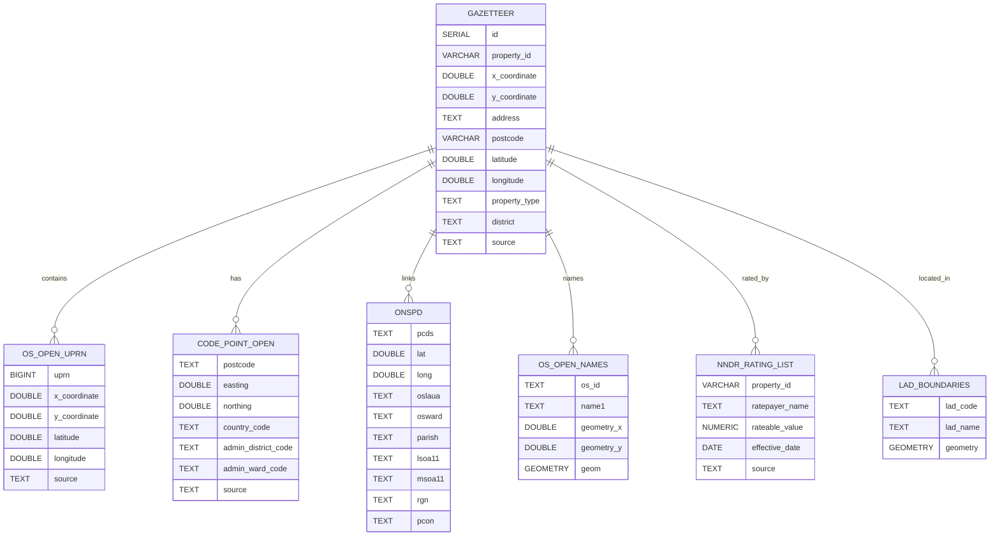
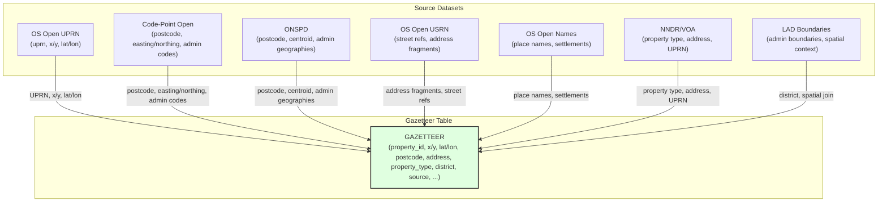

# NNDR Insight Backend

## Overview
This backend is responsible for ingesting, transforming, and managing UK geospatial and property datasets for the NNDR Insight project. It leverages a PostGIS-enabled PostgreSQL database and provides the data foundation for spatial analysis, mapping, and forecasting.

## Database Setup (Moved to setup/ directory)

All database setup, migration, and configuration files have been moved to the `setup/` directory for better organization:

### Quick Database Setup
```bash
# Set up environment
cd setup/config
cp env.example .env
# Edit .env with your database settings

# Run complete database setup
cd setup/database
python run_complete_db_setup.py

# Run migrations (if needed)
python run_migrations.py --run-all
```

### Environment Variables
- `PGUSER`: Database username (default: nndr)
- `PGPASSWORD`: Database password (default: nndrpass)
- `PGHOST`: Database host (default: localhost)
- `PGPORT`: Database port (default: 5432)
- `PGDATABASE`: Database name (default: nndr_db)

### Setup Directory Structure
```
setup/
├── database/          # Core database setup and migration files
├── config/           # Configuration files (env.example, postgresql.conf)
├── scripts/          # Utility and ingestion scripts
└── docs/            # Setup documentation
```

See `setup/README.md` for comprehensive setup documentation.

## Folder Structure (Post-Reorganization)

```
backend/
├── README.md
├── requirements.txt
├── app/              # FastAPI application code
├── services/         # Business logic and services
├── data/            # Raw and processed datasets
├── business/        # Business logic modules
├── utils/           # Common utility modules
└── venv/           # Python virtual environment
```

**Note**: Database setup, migration, and ingestion scripts have been moved to the `setup/` directory for better organization:

- **setup/database/**: Database initialization, migration, and schema scripts
- **setup/scripts/**: Data ingestion, quality, and diagnostic scripts
- **setup/config/**: Configuration files (env.example, postgresql.conf)
- **setup/docs/**: Setup documentation

### Backend Components
- **app/**: FastAPI application code for serving APIs
- **services/**: Business logic and data services
- **data/**: Raw and processed datasets (CSV, GML, SHP, etc.)
- **business/**: Business logic modules for analytics and forecasting
- **utils/**: Common utility modules for database connections, geometry handling, etc.
- **requirements.txt**: Python dependencies for the backend

## Recommended Ingestion Script Execution Order

All ingestion scripts are now located in `setup/scripts/`. Run them from that directory:

```bash
cd setup/scripts
```

| Step | Script Name                                    | Purpose                                 |
|------|------------------------------------------------|-----------------------------------------|
| 1    | `ingest_lad_boundaries.py`                     | Load LAD boundaries                     |
| 2    | `ingest_gazetteer.py`                          | Load UPRN data into staging             |
| 3    | `ingest_gazetteer_staging_into_gazetteer.py`   | Move/merge UPRN data into gazetteer     |
| 4    | `ingest_code_point_open.py`                    | Load Code-Point Open                    |
| 5    | `ingest_onspd.py`                              | Load ONSPD                              |
| 6    | `ingest_usrn.py`                               | Load OS Open USRN                       |
| 7    | `ingest_osopennames.py`                        | Load OS Open Names                      |
| 8    | `ingest_osopenmaplocal.py`                     | Load OS Open Map – Local                |

*Adjust the order as needed based on your data dependencies and workflow. Always initialize the database before ingestion.*

## Data Directory Details

The `data/` directory contains all the raw and processed datasets required for spatial analysis, property linking, and business rates analytics. Below is a summary of each major file or folder:

| Name / Folder | Description | Typical Contents |
|--------------|-------------|------------------|
| **opname_csv_gb/** | OS Open Names: Gazetteer of place names, settlements, streets, etc. | CSV files with place names, coordinates, and metadata |
| **osopenusrn_202507_gpkg/** | OS Open USRN: Unique Street Reference Numbers for every street in Great Britain | GeoPackage files (GPKG) |
| **codepo_gb/** | Code-Point Open: Postcode to coordinate mapping for the UK | CSV files for each postcode area (e.g., ab.csv, al.csv, etc.) |
| **opmplc_gml3_gb/** | OS Open Map – Local: Vector map data (buildings, roads, etc.) | GML files organized by grid square |
| **osopenuprn_202506_csv/** | OS Open UPRN: Unique Property Reference Numbers with coordinates | CSV files with UPRN, X/Y, lat/long |
| **uk-englandwales-ndr-*-listentries-compiled-epoch-*-baseline-csv/** | NNDR Rating List Entries: Business rates data for different years/epochs | CSV files with property, ratepayer, and valuation data |
| **uk-englandwales-ndr-*-summaryvaluations-compiled-epoch-*-baseline-csv/** | NNDR Summary Valuations: Summary valuation data for NNDR for different years/epochs | CSV files |
| **opmplc_gml3_gb.zip** | Compressed archive of OS Open Map – Local data | Extracts to `opmplc_gml3_gb/` |
| **osopenusrn_202507_gpkg.zip** | Compressed archive of OS Open USRN data | Extracts to `osopenusrn_202507_gpkg/` |
| **opname_csv_gb.zip** | Compressed archive of OS Open Names data | Extracts to `opname_csv_gb/` |
| **codepo_gb.zip** | Compressed archive of Code-Point Open data | Extracts to `codepo_gb/` |
| **osopenuprn_202506_csv.zip** | Compressed archive of OS Open UPRN data | Extracts to `osopenuprn_202506_csv/` |
| **nndr-ratepayers March 2015_0.csv** | Ratepayer data for March 2015 | CSV file |
| **NNDR Rating List  March 2015_0.csv** | NNDR rating list for March 2015 | CSV file |
| **LAD_MAY_2025_UK_BFC.shp/.shx/.dbf/.prj/.cpg/.shp.xml** | Shapefile components for Local Authority District boundaries | Used for spatial joins and mapping |
| **ONSPD_Online_Latest_Centroids.csv** | ONS Postcode Directory: Postcode to centroid coordinates and geographies | Large CSV file |

**Why these are needed:**
- They provide the backbone for property-level, postcode-level, and spatial analysis.
- Enable linking of properties, addresses, ratepayers, and administrative boundaries.
- Support geocoding, mapping, and advanced spatial queries in the NNDR Insight platform.

**Note:** Some files are compressed archives and must be extracted before use. Some spatial files (e.g., shapefiles, GeoPackages, GML) require GIS tools or libraries (e.g., GeoPandas, GDAL) for processing.

## Data Structure Diagram



## Recommended Order for Script Execution

1. **Database Initialization**
   - `python db/init_db.py` or `python db/setup_db.py`
2. **Ingest Local Authority District Boundaries**
   - `python ingest/ingest_lad_boundaries.py`
3. **Ingest OS Open UPRN**
   - `python ingest/ingest_osopenuprn.py`
4. **Ingest Code-Point Open**
   - `python ingest/ingest_code_point_open.py`
5. **Ingest ONSPD (ONS Postcode Directory)**
   - `python ingest/ingest_onspd.py`
6. **Ingest OS Open USRN**
   - `python ingest/ingest_usrn.py`
7. **Ingest OS Open Names**
   - `python ingest/ingest_osopennames.py`
8. **Ingest OS Open Map – Local**
   - `python ingest/ingest_osopenmaplocal.py` (or `_all.py`/`_by_theme.py` as needed)
9. **Ingest NNDR/VOA Rating List and Valuations**
   - `python ingest/ingest_nndr_rating_list.py`

## API Services

After completing the data ingestion, the backend provides comprehensive REST API services for accessing and analyzing the geospatial data.

### Quick Start

1. **Start the API Server**
   ```bash
   cd backend
   python start_api.py
   ```
   
   Or manually:
   ```bash
   cd backend
   uvicorn app.main:app --reload --host 0.0.0.0 --port 8000
   ```

2. **Test the API**
   ```bash
   python test_api.py
   ```

3. **Access Documentation**
   - Swagger UI: http://localhost:8000/docs
   - ReDoc: http://localhost:8000/redoc

### Available APIs

#### Geospatial API (`/api/geospatial`)
- **Geocoding**: Address and postcode geocoding using multiple datasets
- **Property Search**: Search by postcode, address, or UPRN
- **Spatial Queries**: Find properties and places within a radius
- **Statistics**: Database statistics and dataset information
- **Boundaries**: Local Authority District boundaries
- **Health Checks**: API and database health monitoring

#### Analytics API (`/api/analytics`)
- **Coverage Analysis**: Data coverage across regions
- **Density Analysis**: Property density by region
- **Regional Statistics**: Comprehensive regional data
- **Postcode Analysis**: Postcode distribution and quality analysis

#### Legacy APIs
- **Upload**: File upload functionality
- **Forecast**: Forecasting capabilities
- **Map**: Mapping functionality
- **Property Compare**: Property comparison features
- **Tables**: Table data access

### API Documentation

For detailed API documentation, examples, and usage instructions, see:
- [API_README.md](API_README.md) - Comprehensive API documentation
- [test_api.py](test_api.py) - API test script with examples
   - `python ingest/ingest_valuations.py`
   - `python ingest/ingest_nndr_ratepayers.py`
10. **Gazetteer Staging and Finalization**
    - `python ingest/ingest_gazetteer_staging_into_gazetteer.py`
    - `python ingest/ingest_gazetteer.py`
11. **Data Quality and Enrichment (optional, but recommended)**
    - `python quality/enrich_properties_with_latlong.py`
    - `python quality/data_quality_checks.py`
    - `python quality/enrich_categories.py`

*Adjust the order as needed based on your data dependencies and workflow. Always initialize the database before ingestion.*

## Technologies Used
- **Python**: Main language for ETL and backend logic
- **SQLAlchemy**: Database connection and SQL execution
- **GeoPandas, Fiona, Shapely**: Geospatial data processing
- **PostgreSQL + PostGIS**: Database and spatial extension
- **TQDM**: Progress bars for batch operations
- **FastAPI**: (in `app/`) for API/backend

## Data Flow & Script Purposes
- **Ingestion**: Scripts in `ingest/` read from CSV, GML, SHP, and other formats, transform data, and insert into the database with correct geometry types and projections (EPSG:27700).
- **Quality & Enrichment**: Scripts in `quality/` perform post-ingestion data cleaning, enrichment, and validation (e.g., filling missing lat/long, category enrichment, null checks).
- **Schema Management**: `db/init_db.py` ensures the database is ready with all required tables, spatial columns, and indexes.
- **Diagnostics**: Output CSVs and scripts in `diagnostics/` help identify and resolve data mismatches or missing links.
- **Utilities & Business Logic**: Common logic will be extracted into `utils/` and orchestrated via `business/` modules for maintainability and reuse.

## Inferred Requirements
- Use a PostGIS-enabled PostgreSQL database (with spatial columns and indexes).
- Ingest and normalize a variety of UK open geospatial datasets (property, postcode, boundaries, etc.).
- Store all spatial data in EPSG:27700 (British National Grid).
- Support efficient batch ingestion and idempotent table creation.
- Provide scripts for data quality, enrichment, and diagnostics.
- Modular and extensible design for adding new datasets or enrichment steps.

## Recommendations
- Consider centralized logging for all scripts.
- Use a config file or environment variables for DB credentials and paths.
- Add unit/integration tests for critical ETL steps.
- Ensure each script has a docstring and usage example.
- For very large datasets, consider multiprocessing or async ingestion.

## Data Insertion Map: Gazetteer Enrichment from Multiple Sources

The `gazetteer` table is incrementally built and enriched by joining data from multiple open datasets. Each source provides specific columns or enrichment, as shown below:



**Summary Table: Which Dataset Fills Which Gazetteer Columns**

| Gazetteer Column   | Populated by...                |
|--------------------|--------------------------------|
| property_id (UPRN) | OS Open UPRN                   |
| x/y/lat/lon        | OS Open UPRN, Code-Point, ONSPD|
| postcode           | Code-Point, ONSPD              |
| address            | ONSPD, USRN, OS Open Names, NNDR|
| property_type      | NNDR/VOA                       |
| district           | ONSPD, Code-Point, LAD         |
| source             | All (track provenance)         |

Each enrichment step fills more columns in the gazetteer, resulting in a comprehensive, queryable property/location table for analytics and mapping.

---

*This README summarizes the backend's structure, purpose, and requirements. For more details on each script, see inline comments and docstrings within the codebase.* 